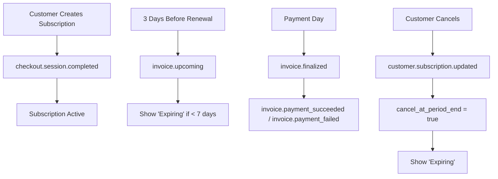

# Stripe Webhook Setup for Subscription Management

## Required Webhook Events

To properly handle subscription status and expiration detection, you need to configure the following webhook events in your Stripe Dashboard:

### Currently Handled Events

1. **`checkout.session.completed`** - When a customer completes checkout
2. **`customer.subscription.created`** - When a subscription is created
3. **`customer.subscription.updated`** - When subscription details change
4. **`customer.subscription.deleted`** - When a subscription is canceled
5. **`invoice.payment_succeeded`** - When a payment succeeds
6. **`invoice.payment_failed`** - When a payment fails

### New Events for Enhanced Expiration Detection

7. **`invoice.upcoming`** ⭐ **IMPORTANT** - Sent 3 days before subscription renewal
   - Used to detect subscriptions approaching renewal
   - Triggers "Expiring" status for subscriptions within 7 days of renewal

8. **`invoice.finalized`** - When an invoice is finalized and ready for payment
   - Useful for additional business logic around billing cycles

## Webhook Configuration Steps

### 1. Access Stripe Dashboard
1. Go to [Stripe Dashboard](https://dashboard.stripe.com)
2. Navigate to **Developers > Webhooks**

### 2. Add/Update Webhook Endpoint
1. Click **"Add endpoint"** or edit existing endpoint
2. Set endpoint URL to: `https://your-supabase-project.supabase.co/functions/v1/stripe-webhook`
3. Select the following events:

```
checkout.session.completed
customer.subscription.created
customer.subscription.updated
customer.subscription.deleted
invoice.payment_succeeded
invoice.payment_failed
invoice.upcoming ⭐ NEW
invoice.finalized ⭐ NEW
```

### 3. Get Webhook Secret
1. After creating/updating the webhook, click on it
2. Copy the **Signing secret** (starts with `whsec_`)
3. Add to your Supabase environment variables as `STRIPE_WEBHOOK_SECRET`

### 4. Test Webhook
1. Use Stripe CLI to test events:
```bash
stripe listen --forward-to localhost:54321/functions/v1/stripe-webhook
stripe trigger invoice.upcoming
```

## Subscription Status Logic

### How "Active" is Determined
A subscription is considered "Active" when:
- `subscription.status === 'active'`
- NOT marked for cancellation (`cancel_at_period_end === false`)
- NOT approaching expiration (more than 7 days until renewal)
- No payment issues

### How "Expiring" is Determined
A subscription is considered "Expiring" (shown in yellow) when:
- `subscription.cancel_at_period_end === true` (canceled but still active)
- `subscription.status === 'past_due'` (payment failed)
- `subscription.status === 'incomplete'` (payment required)
- `subscription.status === 'unpaid'` (payment issues)
- Active subscription with less than 7 days until renewal

### Webhook Event Flow



## Environment Variables Required

Add these to your Supabase project settings:

```env
STRIPE_SECRET_KEY=sk_live_... (or sk_test_...)
STRIPE_PUBLISHABLE_KEY=pk_live_... (or pk_test_...)
STRIPE_WEBHOOK_SECRET=whsec_...
FRONTEND_URL=https://yourdomain.com
```

## Frontend Integration

The frontend automatically detects expiring subscriptions using:

```typescript
import { isSubscriptionExpiring } from '../utils/subscriptionUtils';

// Shows yellow "Expiring" badge instead of green "Active"
const isExpiring = isSubscriptionExpiring(subscription);
```

## Testing Scenarios

To test the expiration logic:

1. **Cancel a subscription** (should show "Expiring")
2. **Create a subscription expiring in < 7 days** (manual database update for testing)
3. **Trigger payment failure** (use Stripe test cards)
4. **Test upcoming renewal** (trigger `invoice.upcoming` event)

## Troubleshooting

- **Webhook not receiving events**: Check endpoint URL and webhook secret
- **Events being ignored**: Verify event types are selected in Stripe Dashboard
- **Status not updating**: Check Supabase logs for webhook processing errors
- **Wrong timezone**: All dates are stored in UTC, calculations account for local time 